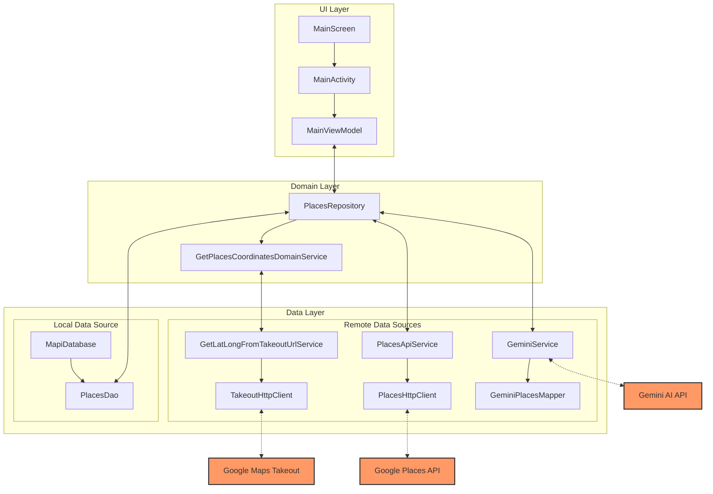

# MaPi - Your Personal Place Finder

MaPi is an Android application that combines Google Maps and Gemini AI to help users find and discover places they've saved. The app syncs with your Google Maps saved places and uses Gemini AI to provide intelligent recommendations based on your preferences.

This project was created by Mahya and Piyush (https://github.com/poush) for the [Google AI Developers Competition](https://ai.google.dev/competition).

Original repository: [github.com/mahyami/mapi](https://github.com/mahyami/mapi)

## Features

- Syncs with your saved Google Maps places
- Uses Gemini AI to recommend places based on your preferences
- Search through your saved places using natural language queries
- Open recommended places directly in Google Maps
- Clean, modern UI built with Jetpack Compose

## Screenshots

| **Welcome Screen** | **User prompt** |
| -------------- | ----------- |
|  |  |

## Architecture

The app follows a clean architecture pattern with three main layers:

1. **UI Layer**: Handles user interactions and display
2. **Domain Layer**: Contains the business logic
3. **Data Layer**: Manages data operations (both remote and local)

## Technologies Used

- Kotlin with Coroutines and Flow
- Jetpack Compose for UI
- MVVM Architecture pattern
- Hilt for dependency injection
- Room for local database storage
- Ktor for network requests
- Gemini AI SDK for intelligent recommendations
- Google Places API for location data

## Resources

- [AI Studio]()
- [Gemini AI Documentation](https://ai.google.dev/docs)
- [Google Places API Documentation](https://developers.google.com/maps/documentation/places/web-service/reference/rest)
- [Data portability API](https://developers.google.com/data-portability/reference/rest)
- [OAUTH2](https://developers.google.com/identity/protocols/oauth2?sjid=8887190340324770543-EU)
- [OAUTH2](https://developer.android.com/identity/authorization)

## Setup

1. Clone the repository
2. Add your API keys in `local.properties`:
   - `GEMINI_API_KEY` for Gemini AI
   - `PLACES_API_KEY` for Google Places API
   - `OAUTH_CLIENT_SECRET`
   - `OAUTH_CLIENT_ID`
3. Set up OAuth (see section below)
4. Build and run the application in Android Studio

## Setting up OAuth flow

The app uses OAuth with Google to get access to the Data Portability API. This API allows the app to fetch saved links and items from the user's account, which are then processed to retrieve saved restaurants.

The app requires the `https://www.googleapis.com/auth/dataportability.saved.collections` scope, which provides access to the user's saved collections through the Data Portability API.

### Get OAuth Credentials
[This](https://developer.android.com/identity/authorization) document shows you how to setup and get OAuth credentials.

Once you get the credentials, you'll need to pick up `client_id`, `client_secret` and fill them in the `AuthenticationService.kt` file.

### Get verified deep link
This app relies on a valid redirect URI that works as a deep link for the app. This allows the redirected page to be captured by the app. For this, you'll need to make sure that you set up a redirect URI which is a publicly accessible domain and verified: https://developer.android.com/training/app-links/verify-android-applinks

Then update the same file `AuthenticationService.kt` with your redirect URI and also update the manifest to set up the intent filter to capture your redirect URL.